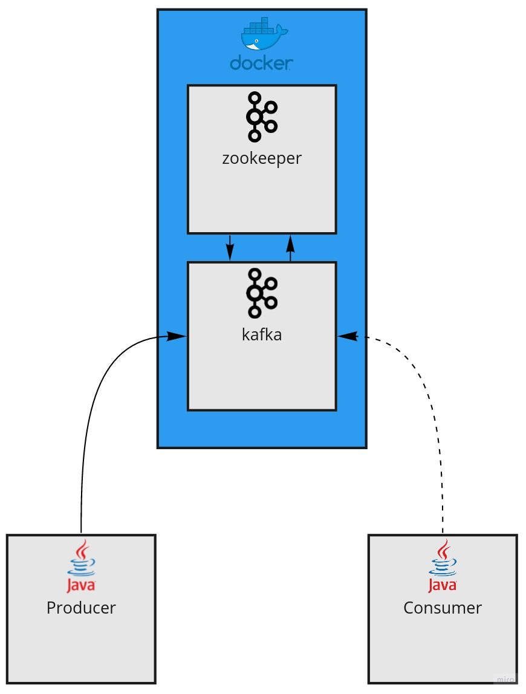

# Kafka with pure Java or with SpringBoot
This project summarize how to use kafka and zookeeper inside two different containers, using bitnami images, and to make a simple java application to produce and other to consume the kafka's topics.

    

You can also see the difference between apache.kafka lib and springframework.kafka lib.

To start the containers, just use:
> docker-compose up -d

To run the commands in commands.txt you need to execute it within the container:
> docker exec -it kafka_kafka_1 bash